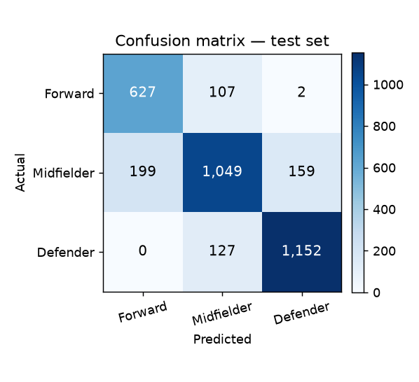
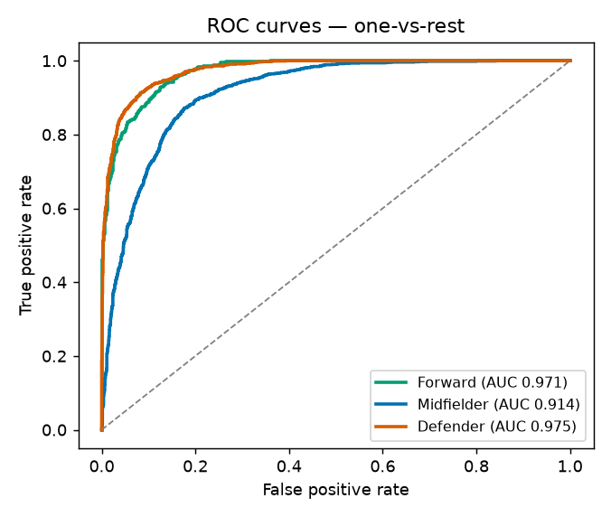
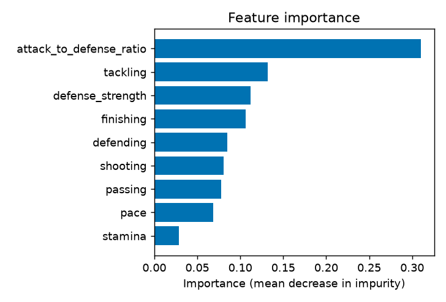

# ⚽ FIFA Player Position Predictor

An interactive demo that predicts a football player's best-fit outfield position —
**Forward, Midfielder, or Defender** — from seven core attributes, with a
confidence score for each class. Move the sliders (or pick a preset like *Striker*
or *Playmaker*) and the model classifies the player instantly.

### 🔗 Live demo → **[fifa-player-position-predictor.streamlit.app](https://fifa-player-position-predictor-8yklyqsvsavrpwepjnmzfd.streamlit.app/)**

## The model

A **scikit-learn Random Forest** trained on the public
[FIFA 22 player dataset](https://www.kaggle.com/datasets/stefanoleone992/fifa-22-complete-player-dataset)
(~17,000 outfield players). It reaches **82.6% test accuracy** across the three
classes — Forwards and Defenders are almost never confused; the residual error
sits, as expected, on the Midfielder boundary.

**Inputs (0–99):** pace, stamina, shooting, passing, finishing, defending, tackling.

**Engineered features** (computed from the inputs, carried over from the original
project design):

- `defense_strength = 0.5·defending + 0.3·tackling + 0.2·stamina`
- `attack_to_defense_ratio = (0.5·shooting + 0.3·passing + 0.2·finishing) / (defending + 1)`

`attack_to_defense_ratio` turns out to be the model's most important single
feature.

## Evaluation

All numbers below are produced by `python train.py` and written to
[`model/metrics.json`](model/metrics.json). Trained on **13,685** players,
evaluated on a held-out **3,422**-player test set (80/20 stratified split, seed 42).

| Metric | Score | What it means |
| --- | --- | --- |
| Accuracy | **82.6%** | fraction of players placed in the right position |
| Macro F1 | **0.824** | F1 averaged evenly across the 3 classes |
| Weighted F1 | **0.826** | F1 weighted by class size |
| ROC-AUC (OvR, macro) | **0.953** | ranking quality — how well the model separates each class from the rest |
| Log loss | **0.380** | penalises confident wrong probabilities (lower is better) |
| Cohen's κ | **0.733** | agreement vs chance — 0.73 is "substantial" |
| Matthews CorrCoef | **0.734** | balanced correlation, robust to class imbalance |

### Cross-validation (5-fold, stratified)

The single split above isn't a fluke — 5-fold CV on the full dataset gives an
almost identical score with a **tiny spread**, i.e. the model generalises:

| Metric | Mean ± Std |
| --- | --- |
| Accuracy | **0.832 ± 0.009** |
| Macro F1 | **0.830 ± 0.009** |

### Per-class

| Class | Precision | Recall | F1 | Support |
| --- | --- | --- | --- | --- |
| ⚽ Forward | 0.759 | 0.852 | **0.803** | 736 |
| 🎯 Midfielder | 0.818 | 0.746 | **0.780** | 1,407 |
| 🛡️ Defender | 0.877 | 0.901 | **0.889** | 1,279 |

### Confusion matrix (rows = actual, cols = predicted)

| | → Forward | → Midfielder | → Defender |
| --- | --- | --- | --- |
| **Forward** | 627 | 107 | 2 |
| **Midfielder** | 199 | 1049 | 159 |
| **Defender** | 0 | 127 | 1152 |

The errors are football-sensible: Forwards and Defenders are almost never
confused (only 2 of 736 Forwards mislabelled Defender), and the residual
confusion sits on the Midfielder boundary — the role that genuinely overlaps
with both attack and defence.

### Feature importance

| Feature | Importance |
| --- | --- |
| `attack_to_defense_ratio` | **0.310** |
| tackling | 0.132 |
| `defense_strength` | 0.112 |
| finishing | 0.106 |
| defending | 0.085 |
| shooting | 0.080 |
| passing | 0.078 |
| pace | 0.068 |
| stamina | 0.028 |

The engineered `attack_to_defense_ratio` is the single strongest predictor —
validating the original project's feature design.

### Charts

Generated by `train.py` into [`assets/`](assets/):

| Confusion matrix | ROC curves (one-vs-rest) | Feature importance |
| --- | --- | --- |
|  |  |  |

The ROC curves show per-class AUC of **0.97** (Forward), **0.91** (Midfielder)
and **0.98** (Defender) — the Midfielder curve trails the others, the same
"in-between role" difficulty visible in the confusion matrix.

## Note on the model

The original project trained a **Spark ML** Random Forest; that artifact was not
preserved, so this demo uses an **equivalent scikit-learn model retrained on the
same public data with the same inputs and classes**. The reported accuracy is this
retrained model's own measured test accuracy.

## Run locally

```bash
pip install -r requirements.txt
python train.py            # regenerates model/model.pkl (auto-downloads the data)
streamlit run streamlit_app.py
```

## Deploy (free)

Hosted on **Streamlit Community Cloud**: push this repo to GitHub, then at
[share.streamlit.io](https://share.streamlit.io) sign in with GitHub, pick the
repo, and set the main file to `streamlit_app.py`.
